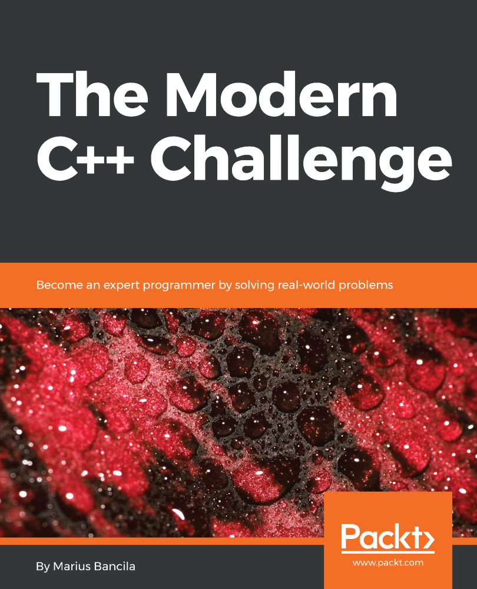

# 모던 C++ 챌린지 스터디

2018년 하반기에 진행하는 모던 C++ 챌린지 스터디 관련 자료입니다.

## 날짜

- 토/일요일 오전 10시 ~ 오후 1시

## 장소

- 토즈 강남 지역 (강남 / 교대 / 양재 / 선릉)

## 스터디 인원

- 16명 (8명 * 2분반)

## 주 교재

- The Modern C++ Challenge: Become an expert programmer by solving real-world problems

## 일정

- 10월 6일 / 7일
    - 자기 소개
    - 아이스 브레이킹
    - 스터디 진행 안내
- 10월 20일
    - Chapter 1: Math Problems
        - 1. Sum of naturals divisible by 3 and 5
        - 2. Greatest common divisior
        - 3. Least common multiple
        - 4. Largest prime smaller than given number
        - 5. Sexy prime pairs
        - 6. Abundant numbers
        - 7. Amicable numbers
        - 8. Armstrong numbers
        - 9. Prime factors of a number
        - 10. Gray code
        - 11. Converting numerical values to Roman
        - 12. Largest Collatz sequence
        - 13. Computing the value of Pi
        - 14. Validating ISBNs
- 11월 3일 / 4일
    - Chapter 2: Language Features
        - 15. IPv4 data type
        - 16. Enumerating IPv4 addresses in a range
        - 17. Creating a 2D array with basic operations
        - 18. Minimum function with any number of arguments
        - 19. Adding a range of values to a container
        - 20. Container any, all, none
        - 21. System handle wrapper
        - 22. Literals of various temperature scales
    - Chapter 3: Strings and Regular Expressions
        - 23. Binary to string conversion
        - 24. String to binary conversion
        - 25. Capitalizing an article title
        - 26. Joining strings together separated by a delimiter
        - 27. Splitting a string into tokens with a list of possible delimiters
        - 28. Longest palindromic substring
        - 29. License plate validation
        - 30. Extracting URL parts
        - 31. Transforming dates in strings    
- 11월 17일 / 18일
    - Chapter 4: Streams and Filesystems
        - 32. Pascal's triangle
        - 33. Tabular printing of a list of processes
        - 34. Removing empty lines from a text file
        - 35. Computing the size of a directory
        - 36. Deleting files older than a given date
        - 37. Finding files in a directory that match a regular expression
        - 38. Temporary log files
    - Chapter 5: Date and Time
        - 39. Measuring function execution time
        - 40. Number of days between two dates
        - 41. Day of the week
        - 42. Day and week of the year
        - 43. Meeting time for multiple time zones
        - 44. Monthly calendar
- 12월 1일 / 2일
    - Chapter 6: Algorithms and Data Structures
        - 45. Priority queue
        - 46. Circular buffer
        - 47. Double buffer
        - 48. The most frequent element in a range
        - 49. Text histogram
        - 50. Filtering a list of phone numbers
        - 51. Transforming a list of phone numbers
        - 52. Generating all the permutations of a string
        - 53. Average rating of movies
        - 54. Pairwise algorithm
        - 55. Zip algorithm
        - 56. Select algorithm
        - 57. Sort algorithm
        - 58. The shortest path between nodes
        - 59. The Weasel program
        - 60. The Game of Life
- 12월 15일 / 16일
    - Chapter 7: Concurrency
        - 61. Parallel transform algorithm
        - 62. Parallel min and max element algorithms using threads
        - 63. Parallel min and max element algorithms using asynchronous functions
        - 64. Parallel sort algorithm
        - 65. Thread-safe logging to the console
        - 66. Customer service system
    - Chapter 8: Design Patterns
        - 67. Validating passwords
        - 68. Generating random passwords
        - 69. Generating social security numbers
        - 70. Approval system
        - 71. Observable vector container
        - 72. Computing order price with discounts
- 1월 5일 / 6일
    - Chapter 9: Data Serialization
        - 73. Serializing and deserializing data to/from XML
        - 74. Selecting data from XML using XPath
        - 75. Serializing data to JSON
        - 76. Deserializing data from JSON
        - 77. Printing a list of movies to a PDF
        - 78. Creating a PDF from a collection of images
    - Chapter 10: Archives, Images, and Databases
        - 79. Finding files in a ZIP archive
        - 80. Compressing and decompressing files to/from a ZIP archive
        - 81. Compressing and decompressing files to/from a ZIP archive with a password
        - 82. Creating a PNG that represents a national flag
        - 83. Creating verification text PNG images
        - 84. EAN-13 barcode generator
        - 85. Reading movies from an SQLite database
        - 86. Inserting movies into SQLite database transactionally
        - 87. Handling movie images in an SQLite database
- 1월 19일 / 20일
    - Chapter 11: Cryptography
        - 88. Caesar cipher
        - 89. Vigenere cipher
        - 90. Base64 encoding and decoding
        - 91. Validating user credentials
        - 92. Computing file hashes
        - 93. Encrypting and decrypting files
        - 94. File signing
    - Chapter 12: Networking and Services
        - 95. Finding the IP address of a host
        - 96. Client-server Fizz-Buzz
        - 97. Bitcoin exchange rates
        - 98. Fetching emails using IMAP
        - 99. Translating text to any language
        - 100. Detecting faces in a picture
    - 스터디 마무리
    - 비용 정산

## 스터디 참고 사항 및 진행 방식

- 스터디 모집 인원은 한 분반 당 8명으로 구성합니다.
- 스터디에 사용하는 책은 개별 구입하셔야 합니다.
- 스터디는 격주 단위로 진행합니다.
    - 2주동안 각자 정해진 분량의 문제들을 풀어옵니다.
    - 서로의 코드를 리뷰하며 더 좋은 해결 방법을 찾기 위해 토론합니다.
    - 즉석에서 문제를 응용해서 풀어보는 시간도 갖습니다.
- 스터디와 관련된 모든 예제 코드는 Github에 업로드합니다.

## 비용

- 12만원 (예치금 4만원 + 장소 대여비 1만원 * 8회)

## 선납금 및 장소 대여비 입금 계좌

- 신한은행 110-471-445816 옥찬호

## 스터디 진행 도우미

- 1분반(토요일) : 옥찬호
- 2분반(일요일) : 박동하